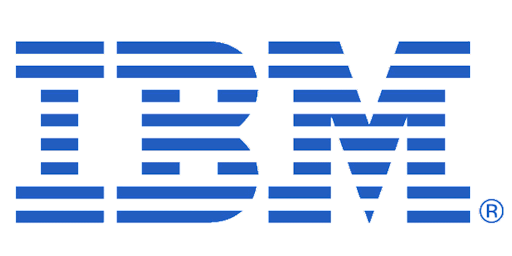

# About

🧑🏼‍💻 &nbsp; Cloud Engineer \& Quantum Ambassador at IBM - 

💻 &nbsp; MSc Computer Science with distinction from UCL - 77.5%

🔭 &nbsp; First class BSc Physics from UCL - 82.95%

# Tech Stack

Programming Languages
| :---: |
|                        |

Cloud | Containers | DevOps \& CI/CD | Data | Databases | Messaging | Quantum | Editors |
| :---: | :---: | :---: | :---: | :---: | :---: | :---: | :---: |
|         |                   |                |                           |             |                          |                           |                         | 
